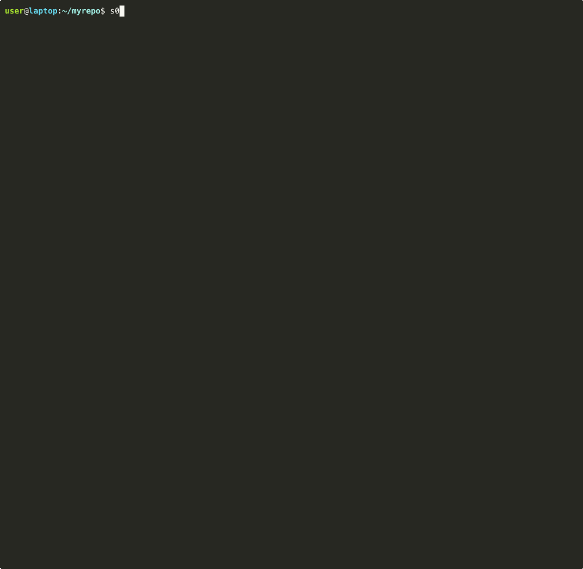

# s0-cli — Security-Zero

An LLM-driven command-line agent for finding security vulnerabilities and "vibe-code" problems (AI-slop patterns: stub authentication, hallucinated imports, dummy crypto, prompt-injection sinks) in any repository, diff, or single file.

s0-cli runs a hybrid of classic static scanners (`semgrep`, `bandit`, `ruff`, `gitleaks`, `trivy`) and LLM detectors, then uses a multi-turn agent to triage, deduplicate, recalibrate severity, and explain each finding. The whole scanning agent is itself optimizable: `s0 optimize` runs a [Meta-Harness](https://yoonholee.com/meta-harness/) outer loop that mutates the agent against a labeled benchmark with a held-out test set.



## Install

```bash
# Standalone binary (Linux / macOS) — no Python needed
curl -fsSL https://raw.githubusercontent.com/antonellof/s0-cli/main/install.sh | bash
```

Three options — pick whichever matches your workflow.

### A. Standalone binary (no Python required)

One-liner — autodetects your OS/arch, picks the right asset from the latest release, verifies its SHA-256, and installs `s0` onto your `$PATH`:

```bash
curl -fsSL https://raw.githubusercontent.com/antonellof/s0-cli/main/install.sh | bash
```

Common variations:

```bash
# Pin a specific version
curl -fsSL https://raw.githubusercontent.com/antonellof/s0-cli/main/install.sh \
  | bash -s -- --version v0.3.2

# Install into your home (no sudo)
curl -fsSL https://raw.githubusercontent.com/antonellof/s0-cli/main/install.sh \
  | bash -s -- --prefix "$HOME/.local"

# Uninstall later
curl -fsSL https://raw.githubusercontent.com/antonellof/s0-cli/main/install.sh \
  | bash -s -- --uninstall
```

```powershell
# Windows (PowerShell)
Invoke-WebRequest -Uri https://github.com/antonellof/s0-cli/releases/latest/download/s0-windows-x86_64.zip -OutFile s0.zip
Expand-Archive .\s0.zip -DestinationPath $env:LOCALAPPDATA
$env:Path += ";$env:LOCALAPPDATA\s0-windows-x86_64"
s0 version
```

The bundle contains every LLM provider plugin (Anthropic / OpenAI / Gemini / OpenRouter / Ollama / Groq / Mistral / DeepSeek / Azure …); you only need to install the SAST scanners you want — `s0 doctor` reports which are present.

Releases for macOS (arm64 / x86_64), Linux (x86_64 / arm64), and Windows (x86_64) are published on the [releases page](https://github.com/antonellof/s0-cli/releases/latest) if you'd rather download the tarball manually.

> **macOS first-launch note** — the binary is unsigned, so the first invocation may take 5–10 s while Gatekeeper validates the embedded `.dylib`s. Subsequent invocations start in ~0.3 s. The installer strips the `com.apple.quarantine` xattr automatically.

### B. From PyPI / source (recommended for development)

```bash
git clone https://github.com/antonellof/s0-cli.git
cd s0-cli
uv sync                    # Python 3.12+, uv >= 0.5

cp .env.example .env       # then fill in one provider key
```

Set one of the supported providers in `.env` and a matching `S0_MODEL`. Everything in `.env` is loaded automatically:


| Provider                                                         | `S0_MODEL` example                       | Required env                                                |
| ---------------------------------------------------------------- | ---------------------------------------- | ----------------------------------------------------------- |
| Anthropic                                                        | `anthropic/claude-sonnet-4-6`            | `ANTHROPIC_API_KEY`                                         |
| OpenAI                                                           | `openai/gpt-5o-mini`                     | `OPENAI_API_KEY`                                            |
| Gemini                                                           | `gemini/gemini-2.5-flash`                | `GEMINI_API_KEY`                                            |
| **OpenRouter** *(gateway to ~100 hosted models)*                 | `openrouter/anthropic/claude-sonnet-4.6` | `OPENROUTER_API_KEY` (+ optional `OPENROUTER_API_BASE`)     |
| **Ollama (local)**                                               | `ollama/llama3.1`                        | none — uses `http://localhost:11434`                        |
| **Ollama (cloud / remote)**                                      | `ollama_chat/qwen2.5-coder`              | `OLLAMA_API_BASE=https://…` (+ `OLLAMA_API_KEY` if proxied) |
| **Self-hosted OpenAI-compatible** *(vLLM, llama.cpp, LM Studio)* | `openai/your-model`                      | `OPENAI_API_BASE=http://localhost:8000/v1`                  |
| Groq, Mistral, DeepSeek, Azure OpenAI                            | see `.env.example`                       | provider-specific                                           |


Any [litellm-supported model](https://docs.litellm.ai/docs/providers) works — `S0_MODEL` is passed through as-is.

#### Configuring the standalone binary

When you run `s0` from the standalone binary you usually don't have a project-local `.env`. Provider keys are resolved in this order (first hit wins):

1. **Shell environment**: `OPENAI_API_KEY=sk-... s0 scan .` — works everywhere, ideal for CI.
2. **`--env-file PATH`** (or short `-e PATH`): `s0 -e ~/secrets/s0.env scan .`
3. **`S0_ENV_FILE`** environment variable pointing at a file.
4. **`./.env`** in the current working directory.
5. **`~/.config/s0/.env`** — the recommended location for the binary.
6. **`~/.s0/.env`** — alternate alias.

The same precedence applies to `S0_MODEL`, `S0_DEFAULT_HARNESS`, `S0_FAIL_ON`, etc. So a one-time setup for daily use looks like:

```bash
mkdir -p ~/.config/s0
cp .env.example ~/.config/s0/.env       # edit + add your provider key
s0 scan ./any/repo                      # works from any directory
```

System scanners are auto-discovered. Install whatever subset you want; missing ones are silently skipped:

```bash
brew install semgrep gitleaks trivy
uv tool install bandit
uv tool install ruff

# Optional supply-chain backends (each independently optional):
brew install osv-scanner                # OSV-Scanner — broader CVE coverage than Trivy on OSS lockfiles
go install github.com/ossf/scorecard/v5@latest   # OpenSSF Scorecard — repo trust signals
uv tool install guarddog                # guarddog — flags malicious PyPI packages

uv run s0 doctor          # confirms which scanners + LLM keys are live
uv run s0 scanners        # one-line description of every available scanner
```

Restrict or exclude scanners per-scan:

```bash
uv run s0 scan ./repo --scanner semgrep --scanner bandit       # only these two
uv run s0 scan ./repo -s semgrep                               # short form
uv run s0 scan ./repo --exclude-scanner trivy -x gitleaks      # use defaults minus these
```

## Quickstart

```bash
# Scan an entire repository (default agent: triages classic + AI-slop scanners)
uv run s0 scan ./path/to/repo

# Hunt UNKNOWN vulnerability classes (SSRF, IDOR, auth bypass, race, ...)
# — LLM-driven, no scanner seeds, finds bugs pattern matchers cannot
uv run s0 scan ./path/to/repo --harness vulnhunter_v0

# Scan only the diff against a branch (great for PRs)
uv run s0 scan ./path/to/repo --mode diff --diff main

# Scan a single file
uv run s0 scan ./path/to/repo/file.py --mode file

# Skip the LLM entirely; raw scanner findings only (zero-cost smoke test)
uv run s0 scan ./path/to/repo --no-llm --format sarif --out report.sarif

# Just the supply-chain layer (CVEs + repo trust + malicious-pkg heuristics)
uv run s0 scan ./path/to/repo --no-llm --scanner supply_chain

# Fail the build if any high-severity issue is found
uv run s0 scan . --fail-on high

# Stream every step the agent takes (scanners, LLM turns, tool calls)
uv run s0 scan ./path/to/repo -v

# Inspect what the agent did (full prompt + tool trace per scan)
uv run s0 runs list
uv run s0 runs show <run_id>
uv run s0 runs grep "CWE-89"
```

> **Tip — combine the agents.** Run both for full coverage: `s0 scan ./repo && s0 scan ./repo --harness vulnhunter_v0`. The first calibrates known-class findings (semgrep / bandit / trivy / supply_chain seeds → LLM triage). The second hunts novel classes pattern matchers cannot see (SSRF, IDOR, auth bypass, TOCTOU, mass assignment, subtle crypto, path traversal). Findings from both runs share the same fingerprint scheme, so downstream tools dedup automatically.

### Output formats

`s0 scan` writes one of seven formats via `--format`. The default is picked automatically: rich `terminal` UI when stdout is a TTY, `markdown` when piped or written to `--out`.


| Format     | Use case                                                                                                | Default for                                       |
| ---------- | ------------------------------------------------------------------------------------------------------- | ------------------------------------------------- |
| `terminal` | Color-coded Rich panels, grouped by severity → file. Streams safely on huge result sets.                | Interactive `s0 scan ./repo`                      |
| `markdown` | GitHub-flavored MD with collapsible code-snippet `<details>`. Drop into PR comments.                    | Piped output, `--out report.md`                   |
| `json`     | Full normalized findings + scanner-raw payloads + fingerprints. Stable schema.                          | Programmatic consumers                            |
| `sarif`    | OASIS Static Analysis Results.                                                                          | GitHub code-scanning, GitLab SAST, Azure DevOps   |
| `csv`      | One row per finding. Pipe to `column -s, -t`, `pandas.read_csv`, Excel.                                 | Spreadsheets, ad-hoc analysis                     |
| `gitlab`   | [Code Quality](https://docs.gitlab.com/ee/ci/testing/code_quality.html) JSON (Code Climate compatible). | GitLab MR widgets, GitHub Code Quality            |
| `junit`    | JUnit XML — every finding becomes a failed test, one suite per severity.                                | Jenkins, CircleCI, Azure Pipelines test reporters |


```bash
# Pretty terminal output (the default — same as omitting --format)
uv run s0 scan ./repo

# Markdown report you can paste into a PR
uv run s0 scan ./repo --format markdown --out scan.md

# CSV for spreadsheet triage
uv run s0 scan ./repo --format csv --out scan.csv

# GitLab MR Code Quality widget
uv run s0 scan ./repo --format gitlab --out gl-code-quality.json

# CI test-reporter (JUnit XML)
uv run s0 scan ./repo --format junit --out s0-junit.xml
```

## Quickstart: optimize the agent

s0-cli ships **two loops** that work together:


| Loop                 | Command               | What it does                                                 | When to run it                  |
| -------------------- | --------------------- | ------------------------------------------------------------ | ------------------------------- |
| **Inner** (scan)     | `s0 scan ./your-repo` | Finds vulnerabilities in your code                           | every PR, every nightly         |
| **Outer** (optimize) | `s0 optimize -n N`    | Makes the *agent itself* smarter against a labeled benchmark | when you want a sharper scanner |


The outer loop doesn't scan your repo — it rewrites the scanning agent (a single Python file under `src/s0_cli/harnesses/`) and scores each rewrite on `bench/tasks_train/`. The improved agent then gets used by the next `s0 scan` you run on your code. This is the [Meta-Harness](https://yoonholee.com/meta-harness/) approach — see the [design section](#optimizing-the-agent-meta-harness) below for the rationale.

```bash
# 3 proposer iterations on the training bench, then a held-out test pass
uv run s0 optimize -n 3

# Want to see it work without spending tokens? Stub the LLM (zero-cost smoke test)
uv run s0 optimize -n 1 --no-llm

# Or fan out 2 parallel proposals per iteration and keep the best
uv run s0 optimize -n 5 -k 2 --fresh --run-name exp1
```

Each iteration writes a new harness file under `src/s0_cli/harnesses/` plus a scored run under `runs/`. The session ends with a final pass on `bench/tasks_test/` (the held-out set) so you can see the train→test generalization gap.

> **Want it tuned to your codebase?** The shipped bench is generic. To make the agent better at *your* repo's specific failure modes, add real vulns from your codebase as new bench tasks — see [Optimize for your own codebase](#optimize-for-your-own-codebase) below.

## Use it in CI

Three drop-in integrations ship with the repo so you don't have to assemble the runtime yourself. Pick whichever matches your workflow.

### GitHub Action

Wraps `s0 scan` and uploads the SARIF report to your repo's Security tab. Diff mode on PRs, full-repo on `main`/cron.

```yaml
# .github/workflows/s0-scan.yml
name: s0-cli scan
on:
  pull_request:
  push: { branches: [main] }
permissions:
  contents: read
  security-events: write
jobs:
  scan:
    runs-on: ubuntu-latest
    steps:
      - uses: actions/checkout@v4
        with: { fetch-depth: 0 }
      - uses: antonellof/s0-cli@v0
        with:
          mode: ${{ github.event_name == 'pull_request' && 'diff' || 'repo' }}
          fail-on: high
          openai-api-key: ${{ secrets.OPENAI_API_KEY }}
```

Inputs are documented in `[action.yml](action.yml)`. The reusable example in `[.github/workflows/example-pr-scan.yml](.github/workflows/example-pr-scan.yml)` is what we use to dogfood it on this repo.

### Docker

Multi-arch image with every scanner pre-installed (semgrep, bandit, ruff, gitleaks, trivy, ripgrep). Reproducible — versions are pinned in the `[Dockerfile](Dockerfile)`.

```bash
docker run --rm -v "$PWD:/work" -w /work \
  -e OPENAI_API_KEY="$OPENAI_API_KEY" \
  ghcr.io/antonellof/s0-cli:latest scan .
```

The published `:latest` tag tracks `main`; pin to a `vX.Y.Z` tag or a short SHA for reproducible CI.

### pre-commit hook

Two hooks ship in `[.pre-commit-hooks.yaml](.pre-commit-hooks.yaml)`. The fast one runs the deterministic scanners on staged files (no LLM, no API key); the slower one runs the full LLM agent on the diff at push time.

```yaml
# .pre-commit-config.yaml
repos:
  - repo: https://github.com/antonellof/s0-cli
    rev: v0.0.1
    hooks:
      - id: s0-scan-staged                   # every commit, ~1-2s
      - id: s0-scan-diff                     # pre-push, ~30-60s, needs an LLM key
        stages: [pre-push]
```

## Use it from your AI assistant (MCP)

s0-cli ships a built-in **MCP (Model Context Protocol) server** so any MCP-compatible client — **Claude Desktop**, **Claude Code**, **Cursor**, **Continue**, **Zed**, **Cline**, etc. — can use it as a tool. Your assistant calls a typed function instead of you copy-pasting CLI output into chat.

```bash
uv tool install 's0-cli[mcp] @ git+https://github.com/antonellof/s0-cli'
```

Then add **one** snippet to your MCP client's config:

```jsonc
// Cursor: ~/.cursor/mcp.json   ·   Claude Desktop: claude_desktop_config.json
// Claude Code: ~/.claude.json
{
  "mcpServers": {
    "s0-cli": { "command": "s0-mcp", "args": [] }
  }
}
```

You get four tools:


| Tool                                                           | What it does                                                   |
| -------------------------------------------------------------- | -------------------------------------------------------------- |
| `scan_path(path, no_llm, scanners, exclude_scanners, harness)` | Hybrid SAST + LLM scan of a directory or file.                 |
| `scan_diff(repo_path, base, head, no_llm)`                     | Scan only the diff between two git refs (great for PR review). |
| `list_scanners()`                                              | Discover the available scanners.                               |
| `list_harnesses()`                                             | Discover bundled harnesses.                                    |


A **Claude Code skill** (`.claude/skills/s0-cli/SKILL.md`) and a **Cursor rule** (`.cursor/rules/s0-cli.mdc`) ship with the repo too — they teach the assistant *when* to invoke s0 (security audit, vulnerability scan, PR review, "is this AI-generated code safe to ship", etc.) and how to summarize results without dumping 200 raw findings into chat.

Then just ask:

> *"Audit ./src for security issues"*
> *"Scan the diff in this PR"*
> *"Check if there are any hardcoded secrets in this repo"*

→ Full step-by-step setup for every supported client lives in `**[docs/integrations/INSTALL.md](docs/integrations/INSTALL.md)`**.

## Why not just run `semgrep` directly?

Running a single static scanner gives you a wall of JSON; you still have to read every alert, decide which are real, and hunt down the data flow by hand. s0-cli runs the scanners *plus* an LLM agent that does that triage for you — and writes down every step it took so you can audit the result.


|                 | Traditional SAST                   | s0-cli                                                         |
| --------------- | ---------------------------------- | -------------------------------------------------------------- |
| Detection       | one scanner                        | 5 classic scanners + 2 AI-slop detectors, deduped              |
| Triage          | manual (engineer reads each alert) | LLM agent reads source, traces taint, marks FPs                |
| Output          | rule_id + line                     | severity + `why_real` + `fix_hint`, in markdown / JSON / SARIF |
| Audit trail     | none                               | full prompt + every tool call recorded under `runs/`           |
| Reproducibility | re-run and hope                    | replay any past scan from `runs/<id>/`                         |


## How it works


`s0 scan` runs every installed scanner on the target in parallel, deduplicates findings across them by `(path, line, rule_id)`, and hands the result to the inner harness — a multi-turn LLM agent with a tightly scoped tool surface. The agent reads source, greps for taint, blames git history, re-runs scanners with tighter rules, then either accepts each finding (assigning a severity and a `fix_hint`) or marks it as a false positive. Everything it does — the prompt, every tool call, every LLM response — is recorded under `runs/<timestamp>__<harness>__<id>/` so any scan is reproducible and auditable.

Three scanning agents ship out of the box:


| Harness                         | Turns | Strategy                                      | Use                                            |
| ------------------------------- | ----- | --------------------------------------------- | ---------------------------------------------- |
| `baseline_v0_agentic` (default) | ≤30   | triage findings from 8 classic + AI detectors | full investigation (read source, taint, dedup) |
| `baseline_v0_singleshot`        | 1     | one-shot triage of semgrep candidates         | cheap pre-filter / CI fast path                |
| `vulnhunter_v0`                 | ≤25   | LLM hunts novel classes (no scanner seeds)    | find SSRF / IDOR / RCE / auth bypass / TOCTOU  |


Pick one with `--harness <name>` or set `S0_DEFAULT_HARNESS` in `.env`. Run them in sequence (`s0 scan --harness baseline_v0_agentic && s0 scan --harness vulnhunter_v0`) when you want both "calibrate the known" and "find the unknown".

### Detectors

s0-cli ships with two flavors of detector. **Classic / AST** detectors catch known vulnerability classes that someone has already written rules for. **AI / supply-chain** detectors catch the long tail: AI-hallucinated code, intent-level smells, malicious dependencies, and untrustworthy upstream repos.


| Detector              | Catches                                                         | Kind         |
| --------------------- | --------------------------------------------------------------- | ------------ |
| `semgrep`             | broad SAST patterns (auto + p/security-audit + p/owasp-top-ten) | classic      |
| `bandit`              | Python security smells (B-codes)                                | classic      |
| `ruff` (`S`, `B`)     | security + bugbear lints, with severity escalation              | classic      |
| `gitleaks`            | secrets in source (matched values redacted in logs)             | classic      |
| `trivy fs`            | filesystem vulns, secrets, misconfigurations                    | classic      |
| `hallucinated_import` | imports that aren't stdlib, declared, or local                  | AST          |
| `supply_chain`        | OSV-Scanner CVEs + OpenSSF Scorecard trust + guarddog malware   | supply chain |
| `vibe`                | stub auth, dummy crypto, hardcoded backdoors, ...               | LLM detector |


Findings from every detector flow into the same agent loop, which decides what to keep, what to flag as a false positive, and what severity to report. All raw scanner output, every LLM call, and every tool invocation is recorded under `runs/` for replay and audit.

#### Hunting unknown vulnerability classes

Pattern-matching SAST is bounded by what the rule authors thought of. To go beyond that, s0-cli ships two complementary strategies for *novelty*:

- **`supply_chain` scanner** composes three OSS tools that catch supply-chain risk Trivy alone misses:
  - **OSV-Scanner** queries `osv.dev` for CVEs/GHSAs across pip, npm, cargo, go, maven, composer, gem (broader coverage than Trivy on OSS lockfiles).
  - **OpenSSF Scorecard** scores the upstream GitHub repo's *trustworthiness* — unsigned releases, missing branch protection, dead maintainers, no SECURITY.md. None of these are CVEs; all of them predict future incidents.
  - **guarddog** runs heuristic rules against PyPI packages to flag *actively malicious* code (install-time exec, exfil endpoints, typosquats, base64-encoded payloads).
  Each backend is independently optional — install the binary you have and skip the rest. `s0 scanners` shows which are wired.
- `**vulnhunter_v0` harness** is an LLM-driven novelty hunter that doesn't consume scanner seeds. It reads the codebase top-down, maps every HTTP / queue / webhook entry point, and traces tainted-data flow into eight specific bug classes:

  | Class                                         | CWE             |
  | --------------------------------------------- | --------------- |
  | SSRF via webhooks / image proxies             | CWE-918         |
  | Indirect RCE (SSTI, deserialization)          | CWE-94, CWE-502 |
  | IDOR / broken object-level authz              | CWE-639         |
  | Authentication / session bypass               | CWE-287         |
  | Race conditions / TOCTOU                      | CWE-367         |
  | Mass-assignment / unsafe ORM use              | CWE-915         |
  | Crypto mistakes (IV reuse, weak HMAC compare) | CWE-327         |
  | Path traversal through subtle joins           | CWE-22          |

  These are application-logic bugs that depend on *how the pieces compose*, which pattern matchers can't see. Run with `s0 scan PATH --harness vulnhunter_v0` (LLM-required; no `--no-llm` fallback by design).

## Configuration

All settings live in `.env` (see `[.env.example](.env.example)`). The most useful knobs:


| Variable              | Default                       | Purpose                             |
| --------------------- | ----------------------------- | ----------------------------------- |
| `S0_MODEL`            | `anthropic/claude-sonnet-4-5` | Any litellm-compatible model string |
| `S0_DEFAULT_HARNESS`  | `baseline_v0_agentic`         | Which scanning agent `s0 scan` uses |
| `S0_MAX_TURNS`        | `30`                          | Agent tool-loop budget per scan     |
| `S0_TOKEN_BUDGET`     | `200000`                      | Soft input-token cap per scan       |
| `S0_OUTPUT_CAP_BYTES` | `30000`                       | Per-tool-observation byte cap       |
| `S0_RUNS_DIR`         | `./runs`                      | Where to write run artifacts        |
| `S0_FAIL_ON`          | `high`                        | Default `--fail-on` severity floor  |


## Benchmark results

The repository ships with 11 labeled tasks under `bench/` (7 training, 4 held-out for testing generalization). Every task has a `ground_truth.json` listing the real vulnerabilities; the scorer matches predictions by `(path, line ± 5)`. Numbers below are reproducible — run `uv run s0 eval` and `uv run s0 eval --split test` yourself.

Two configurations on `openai/gpt-4o-mini`:


| Configuration                  | Split | TP  | FP    | FN  | Precision | Recall   | F1       | Cost (in/out tokens) |
| ------------------------------ | ----- | --- | ----- | --- | --------- | -------- | -------- | -------------------- |
| `--no-llm` (raw scanners only) | train | 8   | 25    | 0   | 0.24      | **1.00** | 0.39     | 0 / 0                |
| `--no-llm` (raw scanners only) | test  | 5   | 10    | 0   | 0.33      | **1.00** | 0.50     | 0 / 0                |
| `baseline_v0_agentic` (LLM)    | train | 8   | 23    | 0   | 0.26      | **1.00** | 0.41     | 97k / 6k             |
| `baseline_v0_agentic` (LLM)    | test  | 5   | **7** | 0   | **0.42**  | **1.00** | **0.59** | 60k / 2k             |


**What this proves:**

- **Recall = 1.00 in every configuration.** Across all 13 ground-truth vulnerabilities (train + test) — SQL injection, command injection, hallucinated imports, path traversal, weak crypto, hardcoded secrets, JWT no-verify, pickle deserialization, stub auth, … — the deterministic scanner pipeline alone catches every one. The LLM never has to *find* anything; its job is purely to triage what was already found.
- **LLM triage cuts false positives by 30% on the held-out set** (10 → 7) without dropping a single true positive. Held-out F1 climbs from 0.50 → **0.59** (+18% relative).
- **Every scan ends in a fixed turn budget** (median 5 turns, max 11 in this run) and a fixed token budget. No runaway costs.
- **The held-out test split was never seen by the LLM during any optimization run** — generalization is measured, not assumed.

The `--no-llm` mode is a useful free anchor: you keep 100% recall and pay zero LLM cost, at the price of more false positives to skim through. Most CI pipelines will want the LLM mode on PR diffs (small target, low token cost, accurate triage) and the no-LLM mode on full-repo nightly scans.

### Real-world run on an external repo

For an end-to-end demonstration on a real codebase (OWASP **PyGoat**, ~50 modules of deliberate Django vulnerabilities) and a from-scratch optimize loop, see `[docs/results/REAL_WORLD_RESULTS.md](docs/results/REAL_WORLD_RESULTS.md)`. Headline numbers from that run:

- **252 raw scanner findings → 14 kept** by the LLM agent (94% noise reduction). Every kept finding is a genuine OWASP-Top-10-class issue (pickle RCE, hallucinated imports, hardcoded credentials, Docker-as-root, command injection, broken auth, …) with a `why_real` and `fix_hint`.
- A 2-iteration `s0 optimize -n 2 -k 2` session (~$0.12, 174s wall-clock) produced a winning harness that **lifted held-out test F1 from 0.59 → 0.67** (+18% relative). All four candidate harnesses (winners and broken alike), the Pareto frontier, and per-task traces are committed under `docs/results/` so the run is reproducible.

## Benchmark layout

The bench is split into a **train** set (visible to the optimizer) and a **held-out test** set (only scored at the end of an optimize session). See `[bench/README.md](bench/README.md)` for the full task list and how to add new ones.

```bash
# Score the default harness on the training tasks
uv run s0 eval

# Score on the held-out test set
uv run s0 eval --split test

# Just the deterministic scanners, no LLM
uv run s0 eval --no-llm
```

`s0 eval` writes a scored run to `runs/`, the same place `s0 scan` writes; everything is uniformly inspectable with `s0 runs`.

## Optimizing the agent (Meta-Harness)

The scanning agent is a single Python file. Most security tools encode their heuristics either in scattered config (`.semgrepignore`, custom rule files, hand-tuned LLM prompts) or in undocumented engineer intuition. s0-cli encodes them in a versioned harness file that gets *automatically rewritten* by an outer optimization loop, based on real evaluation data — this is the [Meta-Harness](https://yoonholee.com/meta-harness/) approach (Lee et al., 2026).


`s0 optimize` runs the loop: a coding-agent proposer reads `runs/` (every prior agent, every score, every tool trace), forms a hypothesis about the worst current failure mode, writes a new harness file under `src/s0_cli/harnesses/`, and the runner validates and re-scores it on `bench/tasks_train/`. After all training iterations finish, the best-train-F1 candidate is scored once on the disjoint `bench/tasks_test/` to measure generalization. The proposer's contract is in `[SKILL.md](SKILL.md)`.

### Why this is different from "just iterating on the prompt"


|                             | Hand-tuning prompts/rules              | Meta-Harness loop                                                                    |
| --------------------------- | -------------------------------------- | ------------------------------------------------------------------------------------ |
| **What changes**            | a string in a config file              | a whole single-file Python agent (prompts + tools + scanner-selection + dedup logic) |
| **What measures progress**  | "feels better on my test repo"         | a labeled bench scored by F1, precision, recall, tokens, turns                       |
| **What guards overfitting** | nothing                                | held-out `bench/tasks_test/` the proposer never sees                                 |
| **History**                 | `git log` of edits, no scores attached | every attempt + score + full trace lives forever in `runs/<id>/`                     |
| **Cost vs. accuracy**       | implicit; you pick one config          | explicit Pareto frontier (F1 ↑ vs. tokens ↓) snapshotted to `runs/_frontier.json`    |
| **Reproducibility**         | rerun and hope                         | `s0 runs show <id>` replays the exact harness file, prompts, and tool calls          |
| **Rollback**                | manual revert                          | the prior harness file is still on disk; just point `S0_DEFAULT_HARNESS` at it       |


### Concrete leverage

- **Search beats intuition.** The proposer can try ideas a human wouldn't bother with — "lower confidence on bandit B608 inside `tests/` directories", "escalate to critical when `pickle.loads` is reachable from a Flask handler", "skip semgrep's `python.lang.security.audit.dangerous-subprocess-use` for `subprocess.run` calls whose first argument is a list literal" — and *measure* whether each one helps.
- **Pareto, not point estimates.** Real choice in CI isn't "best F1", it's "best F1 at the token budget I can afford on a PR". The frontier file gives you that menu directly.
- **Generalization is enforced.** The proposer can't see `tasks_test/` and the loop refuses to start if the train and test paths resolve to the same directory. So a +0.1 F1 on train that comes with a -0.05 test gap shows up in the summary table — you can't cheat your own benchmark.
- **Every iteration is auditable.** Each attempt is one new file plus a `runs/<id>/` directory containing `harness.py`, `score.json`, `summary.md`, and per-task traces with the full prompt and every tool call. Disk-as-database; no schema migrations, just `grep`.

### Multi-candidate proposals

Pass `-k N` (or `--candidates N`) to fan out **N parallel proposals per iteration**, each with a different temperature, seed harness, and focus directive. The runner evaluates them concurrently and keeps the highest-F1 winner; losers are still recorded under `runs/` so you can see what each design slot tried.

```bash
# 2 parallel proposals per iteration; pick the better one each time
uv run s0 optimize -n 5 -k 2 --run-name exp_multicand --fresh
```

Cost scales linearly with `k`, but wall-clock cost stays roughly constant (the proposers run concurrently). The strategy ladder lives in `[src/s0_cli/optimizer/strategies.py](src/s0_cli/optimizer/strategies.py)` and is deterministic — `k=2` always means slot 0 (greedy, exploit) plus slot 1 (warmer, "shrink token cost"), so reruns hit the same regions of design space.

```bash
uv run s0 optimize -n 3                            # 3 iterations on train, then held-out test pass
uv run s0 optimize -n 5 --fresh --run-name exp1    # isolate under runs/exp1/, clean slate
uv run s0 optimize -n 1 --no-llm                   # smoke test the loop, zero tokens spent
```

After every iteration the Pareto frontier (F1 vs. tokens) is snapshotted to `runs/_frontier.json`. The session ends with a final pass on `bench/tasks_test/` that prints the train→test generalization gap. `Ctrl+C` finishes the current iteration and exits cleanly; press it twice to abort.

Inspect what the agents are doing:

```bash
uv run s0 runs list                       # all runs, newest first
uv run s0 runs frontier                   # only the Pareto frontier
uv run s0 runs show <run_id>              # score + summary + harness diff
uv run s0 runs diff <run_a> <run_b>       # side-by-side
uv run s0 runs grep "<regex>"             # ripgrep across all traces
uv run s0 runs tail-traces <run_id> <task_id>
```

## Optimize for your own codebase

Out of the box, `s0 optimize` improves the agent against the 11 generic tasks shipped under `bench/` (SQL injection, XSS, path traversal, hardcoded secrets, …). That gives you an agent that's good at *common* security bugs. To get one that's good at *your* codebase's specific failure modes, mix in your own labeled tasks — usually drawn from past CVEs, post-mortems, pentest findings, or alerts you've manually triaged.

### Why you can't just point it at a folder

A natural first instinct is `s0 optimize ./my-repo` — let the optimizer chew on a real codebase and "get better over time". It can't, because the optimizer needs to know whether each rewrite of the agent is *better* than the previous one. That requires labels: a `ground_truth.json` that says "these N findings are real, anything else is noise". Without labels every change is unfalsifiable — F1 is undefined and the loop has no signal to climb. Pointing the optimizer at raw source would be like training a model with no loss function.

The good news: **a tiny amount of labeled data goes a long way.** 3–5 in-house tasks are enough to start biasing the agent toward your stack.

### Add a real vulnerability as a bench task

Each task is two files: a `target/` directory holding the offending source, and a `ground_truth.json` listing the expected findings. Bootstrap from a known issue in your repo:

```bash
# 1. Copy the offending file(s) into a new task directory
mkdir -p bench/tasks_train/myco_sqli_001/target
cp ./your-repo/api/users.py bench/tasks_train/myco_sqli_001/target/

# 2. Write the label (one entry per ground-truth finding)
cat > bench/tasks_train/myco_sqli_001/ground_truth.json <<'EOF'
[
  {
    "rule_id": "sqli-fstring",
    "severity": "critical",
    "path": "target/users.py",
    "line": 42,
    "cwe": ["CWE-89"],
    "note": "f-string user_id into cur.execute"
  }
]
EOF

# 3. Sanity-check that the deterministic scanners can at least see it
uv run s0 eval --only myco_sqli_001 --no-llm

# 4. Re-run the optimizer; the proposer is now scored on your task too
uv run s0 optimize -n 5

# 5. Use the resulting (improved) harness in CI on the full repo
uv run s0 scan ./your-repo --fail-on high
```

The matcher is forgiving: a prediction matches a label if `path` is identical and `|line - gt.line| <= 5`, so you don't have to be exact on line numbers. Severity isn't matched on; it's scored separately. The full task format (multi-file targets, optional task README, etc.) is documented in `[bench/README.md](bench/README.md)`.

### Continuous-improvement loop

Once you have one in-house task the loop closes:

```
   real vulns      ──add as bench task──▶  bench/tasks_train/<myco_xxx>/
   ─────────────                                       │
   • post-mortems                                      │ s0 optimize -n N
   • pentest reports                                   ▼
   • dismissed alerts                       src/s0_cli/harnesses/<new>.py
   • prod incidents                                    │
        ▲                                              │ s0 scan ./your-repo (CI)
        │                                              ▼
        │                                       findings on prod code
        │                                              │
        └──── any confirmed miss / verified FP ────────┘
                  (promote to a new bench task)
```

Every confirmed miss or verified false positive in production becomes a new training task. Over months your bench grows, and the agent gets sharper at the failure modes that actually appear in your stack — *that* is the "security improvements over time" loop, and it's powered by labels rather than by pointing at a folder.

### How many tasks do I need?


| In-house tasks | What you get                                                                                       |
| -------------- | -------------------------------------------------------------------------------------------------- |
| 0              | a general agent (the shipped baseline)                                                             |
| 1–3            | the proposer notices your task class and biases toward it                                          |
| 5–10           | meaningful tilt toward your codebase's vuln distribution                                           |
| 20+            | diminishing returns; consider moving 20–30% into `tasks_test/` to measure your-repo generalization |


Mix your tasks with the shipped ones — never replace them, or the optimizer will overfit your distribution and lose general competence.

### Tips

- **Sources of labels.** Past CVEs in your dependency tree, post-mortems, internal pentest reports, the security-team backlog, alerts you've already triaged in `runs/` (use `s0 runs grep` to find them).
- **Keep tasks small.** A few hundred lines of source per `target/`, not the whole module. The harness only needs enough context to triage one finding correctly.
- **Redact secrets.** `target/` is committed to git. If you're labeling a leaked-credential bug, replace the secret with `EXAMPLE_REDACTED` before committing — the scanners care about the *shape*, not the value.
- **Hold some out.** As you accumulate tasks, move 20–30% into `bench/tasks_test/` so generalization is measured, not assumed. The optimizer is sandboxed from `tasks_test/` automatically.
- **Privacy.** If you can't put real source in the repo, keep your `bench/tasks_train/myco_*/` directory outside git and point `s0 optimize` at it: `uv run s0 optimize -n 5 --bench /path/to/private-bench`.

## How the LLM is used


| Stage                  | Detection        | Reasoning                  | Decision         |
| ---------------------- | ---------------- | -------------------------- | ---------------- |
| Static scan            | classic scanners | —                          | —                |
| Triage                 | —                | LLM (single-shot or agent) | LLM              |
| Investigation          | LLM tool loop    | LLM tool loop              | LLM              |
| Vibe-code detector     | LLM as scanner   | LLM (same call)            | LLM              |
| Optimizer (`optimize`) | —                | proposer LLM               | evaluator (code) |


You can run with `--no-llm` to use only the deterministic scanners and no LLM at all — useful as a free baseline and for CI.

## Project layout

```
src/s0_cli/
  cli.py              entrypoint (typer)
  config.py           pydantic-settings + .env loader
  harness/            base classes, native tool calling, agent loop
  harnesses/          scanning agents (single-file, swappable)
  scanners/           deterministic + LLM detectors
  targets/            repo / diff / file scan targets
  eval/               bench runner + scorer + static validator
  optimizer/          outer Meta-Harness loop + proposer
  runs/               run-store CLI + filesystem schema
  reporters/          markdown / json / sarif renderers
  prompts/            system prompts (per-harness)
bench/
  tasks_train/        7 labeled tasks, visible to the optimizer
  tasks_test/         4 held-out tasks for generalization scoring
SKILL.md              proposer contract (read by the outer loop)
```

## References

- Lee et al. **Meta-Harness: End-to-End Optimization of Model Harnesses.** arXiv:2603.28052 (2026). [paper](https://arxiv.org/abs/2603.28052) · [code](https://github.com/stanford-iris-lab/meta-harness) · [tbench2 artifact](https://github.com/stanford-iris-lab/meta-harness-tbench2-artifact)
- KRAFTON AI & Ludo Robotics. **Terminus-KIRA.** [github.com/krafton-ai/KIRA](https://github.com/krafton-ai/KIRA)

## License

Apache-2.0. See [LICENSE](LICENSE).