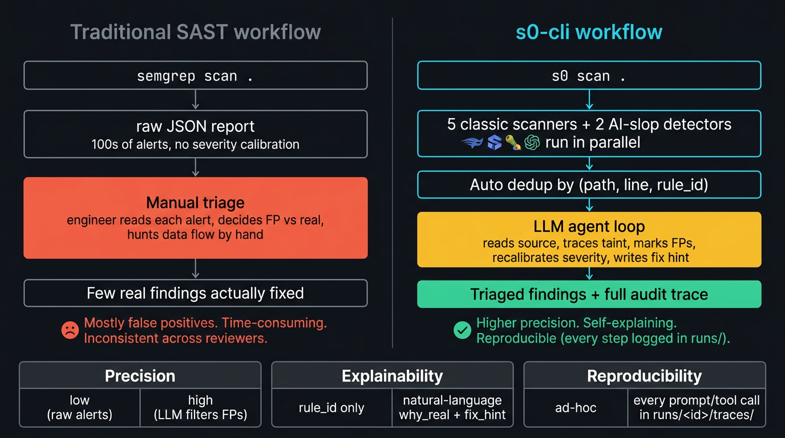
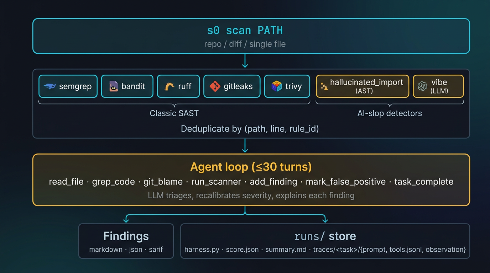
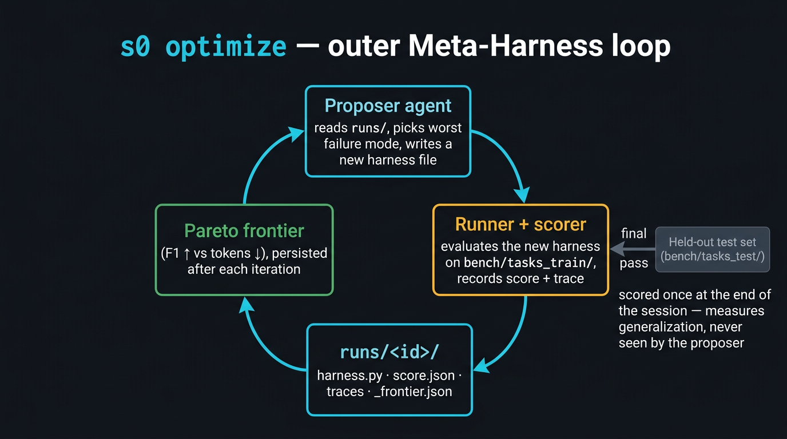

# s0-cli — Security-Zero

An LLM-driven command-line agent for finding security vulnerabilities and "vibe-code" problems (AI-slop patterns: stub authentication, hallucinated imports, dummy crypto, prompt-injection sinks) in any repository, diff, or single file.

s0-cli runs a hybrid of classic static scanners (`semgrep`, `bandit`, `ruff`, `gitleaks`, `trivy`) and LLM detectors, then uses a multi-turn agent to triage, deduplicate, recalibrate severity, and explain each finding. The whole scanning agent is itself optimizable: `s0 optimize` runs a [Meta-Harness](https://yoonholee.com/meta-harness/) outer loop that mutates the agent against a labeled benchmark with a held-out test set.

```
$ uv run s0 scan ./my-app

  hallucinated import           src/email.py:8       critical   CWE-829
    `import emailclient` — no such package on PyPI; nearest match is
    `emailclient-aws` (likely typosquat). Suggest pinning `email-validator`.

  SQL injection (f-string)      src/api/users.py:42  critical   CWE-89
    `cur.execute(f"SELECT … {user_id}")`. Use `cur.execute("… ?", (user_id,))`.

  weak password hashing         src/auth/hash.py:7   high       CWE-327
    `hashlib.md5(...)` for password storage. Use `argon2-cffi` or `bcrypt`.

3 findings (1 critical hidden as triage filtered out 6 false positives)
```

## Install

```bash
git clone https://github.com/<your-org>/s0-cli.git
cd s0-cli
uv sync                    # Python 3.12+, uv >= 0.5

cp .env.example .env       # then fill in one provider key
```

Set one of `ANTHROPIC_API_KEY`, `OPENAI_API_KEY`, or `GEMINI_API_KEY` and the matching `S0_MODEL` (default: `anthropic/claude-sonnet-4-5`). Everything in `.env` is loaded automatically.

System scanners are auto-discovered. Install whatever subset you want; missing ones are silently skipped:

```bash
brew install semgrep gitleaks trivy
uv tool install bandit ruff
uv run s0 doctor          # confirms which scanners + LLM keys are live
```

## Quickstart

```bash
# Scan an entire repository
uv run s0 scan ./path/to/repo

# Scan only the diff against a branch (great for PRs)
uv run s0 scan ./path/to/repo --mode diff --diff main

# Scan a single file
uv run s0 scan ./path/to/repo/file.py --mode file

# Skip the LLM entirely; raw scanner findings only (zero-cost smoke test)
uv run s0 scan ./path/to/repo --no-llm --format sarif --out report.sarif

# Fail the build if any high-severity issue is found
uv run s0 scan . --fail-on high

# Stream every step the agent takes (scanners, LLM turns, tool calls)
uv run s0 scan ./path/to/repo -v

# Inspect what the agent did (full prompt + tool trace per scan)
uv run s0 runs list
uv run s0 runs show <run_id>
uv run s0 runs grep "CWE-89"
```

Output formats: `markdown` (default, human-readable), `json`, `sarif` (for GitHub code-scanning, GitLab SAST, etc.).

## Use it in CI

Three drop-in integrations ship with the repo so you don't have to assemble the runtime yourself. Pick whichever matches your workflow.

### GitHub Action

Wraps `s0 scan` and uploads the SARIF report to your repo's Security tab. Diff mode on PRs, full-repo on `main`/cron.

```yaml
# .github/workflows/s0-scan.yml
name: s0-cli scan
on:
  pull_request:
  push: { branches: [main] }
permissions:
  contents: read
  security-events: write
jobs:
  scan:
    runs-on: ubuntu-latest
    steps:
      - uses: actions/checkout@v4
        with: { fetch-depth: 0 }
      - uses: antonellof/s0-cli@v0
        with:
          mode: ${{ github.event_name == 'pull_request' && 'diff' || 'repo' }}
          fail-on: high
          openai-api-key: ${{ secrets.OPENAI_API_KEY }}
```

Inputs are documented in [`action.yml`](action.yml). The reusable example in [`.github/workflows/example-pr-scan.yml`](.github/workflows/example-pr-scan.yml) is what we use to dogfood it on this repo.

### Docker

Multi-arch image with every scanner pre-installed (semgrep, bandit, ruff, gitleaks, trivy, ripgrep). Reproducible — versions are pinned in the [`Dockerfile`](Dockerfile).

```bash
docker run --rm -v "$PWD:/work" -w /work \
  -e OPENAI_API_KEY="$OPENAI_API_KEY" \
  ghcr.io/antonellof/s0-cli:latest scan .
```

The published `:latest` tag tracks `main`; pin to a `vX.Y.Z` tag or a short SHA for reproducible CI.

### pre-commit hook

Two hooks ship in [`.pre-commit-hooks.yaml`](.pre-commit-hooks.yaml). The fast one runs the deterministic scanners on staged files (no LLM, no API key); the slower one runs the full LLM agent on the diff at push time.

```yaml
# .pre-commit-config.yaml
repos:
  - repo: https://github.com/antonellof/s0-cli
    rev: v0.0.1
    hooks:
      - id: s0-scan-staged                   # every commit, ~1-2s
      - id: s0-scan-diff                     # pre-push, ~30-60s, needs an LLM key
        stages: [pre-push]
```

## Why not just run `semgrep` directly?

Running a single static scanner gives you a wall of JSON; you still have to read every alert, decide which are real, and hunt down the data flow by hand. s0-cli runs the scanners *plus* an LLM agent that does that triage for you — and writes down every step it took so you can audit the result.



| | Traditional SAST | s0-cli |
| - | - | - |
| Detection | one scanner | 5 classic scanners + 2 AI-slop detectors, deduped |
| Triage | manual (engineer reads each alert) | LLM agent reads source, traces taint, marks FPs |
| Output | rule_id + line | severity + `why_real` + `fix_hint`, in markdown / JSON / SARIF |
| Audit trail | none | full prompt + every tool call recorded under `runs/` |
| Reproducibility | re-run and hope | replay any past scan from `runs/<id>/` |

## How it works



`s0 scan` runs every installed scanner on the target in parallel, deduplicates findings across them by `(path, line, rule_id)`, and hands the result to the inner harness — a multi-turn LLM agent with a tightly scoped tool surface. The agent reads source, greps for taint, blames git history, re-runs scanners with tighter rules, then either accepts each finding (assigning a severity and a `fix_hint`) or marks it as a false positive. Everything it does — the prompt, every tool call, every LLM response — is recorded under `runs/<timestamp>__<harness>__<id>/` so any scan is reproducible and auditable.

Two scanning agents ship out of the box:

| Harness                         | Turns | Use                                              |
| ------------------------------- | ----- | ------------------------------------------------ |
| `baseline_v0_agentic` (default) | ≤30   | full investigation (read source, taint, dedup)   |
| `baseline_v0_singleshot`        | 1     | cheap pre-filter / CI fast path                  |

Pick one with `--harness <name>` or set `S0_DEFAULT_HARNESS` in `.env`.

### Detectors

| Detector              | Catches                                              | Kind          |
| --------------------- | ---------------------------------------------------- | ------------- |
| `semgrep`             | broad SAST patterns (auto + p/security-audit + p/owasp-top-ten) | classic       |
| `bandit`              | Python security smells (B-codes)                     | classic       |
| `ruff` (`S`, `B`)     | security + bugbear lints, with severity escalation   | classic       |
| `gitleaks`            | secrets in source (matched values redacted in logs)  | classic       |
| `trivy fs`            | filesystem vulns, secrets, misconfigurations         | classic       |
| `hallucinated_import` | imports that aren't stdlib, declared, or local       | AST           |
| `vibe`                | stub auth, dummy crypto, hardcoded backdoors, ...    | LLM detector  |

Findings from every detector flow into the same agent loop, which decides what to keep, what to flag as a false positive, and what severity to report. All raw scanner output, every LLM call, and every tool invocation is recorded under `runs/` for replay and audit.

## Configuration

All settings live in `.env` (see [`.env.example`](.env.example)). The most useful knobs:

| Variable               | Default                            | Purpose                                  |
| ---------------------- | ---------------------------------- | ---------------------------------------- |
| `S0_MODEL`             | `anthropic/claude-sonnet-4-5`      | Any litellm-compatible model string      |
| `S0_DEFAULT_HARNESS`   | `baseline_v0_agentic`              | Which scanning agent `s0 scan` uses      |
| `S0_MAX_TURNS`         | `30`                               | Agent tool-loop budget per scan          |
| `S0_TOKEN_BUDGET`      | `200000`                           | Soft input-token cap per scan            |
| `S0_OUTPUT_CAP_BYTES`  | `30000`                            | Per-tool-observation byte cap            |
| `S0_RUNS_DIR`          | `./runs`                           | Where to write run artifacts             |
| `S0_FAIL_ON`           | `high`                             | Default `--fail-on` severity floor       |

## Benchmark results

The repository ships with 11 labeled tasks under `bench/` (7 training, 4 held-out for testing generalization). Every task has a `ground_truth.json` listing the real vulnerabilities; the scorer matches predictions by `(path, line ± 5)`. Numbers below are reproducible — run `uv run s0 eval` and `uv run s0 eval --split test` yourself.

Two configurations on `openai/gpt-4o-mini`:

| Configuration                   | Split | TP | FP | FN | Precision | Recall | F1   | Cost (in/out tokens)     |
| ------------------------------- | ----- | -- | -- | -- | --------- | ------ | ---- | ------------------------ |
| `--no-llm` (raw scanners only)  | train | 8  | 25 | 0  | 0.24      | **1.00** | 0.39 | 0 / 0                  |
| `--no-llm` (raw scanners only)  | test  | 5  | 10 | 0  | 0.33      | **1.00** | 0.50 | 0 / 0                  |
| `baseline_v0_agentic` (LLM)     | train | 8  | 23 | 0  | 0.26      | **1.00** | 0.41 | 97k / 6k               |
| `baseline_v0_agentic` (LLM)     | test  | 5  | **7**  | 0  | **0.42** | **1.00** | **0.59** | 60k / 2k          |

**What this proves:**

- **Recall = 1.00 in every configuration.** Across all 13 ground-truth vulnerabilities (train + test) — SQL injection, command injection, hallucinated imports, path traversal, weak crypto, hardcoded secrets, JWT no-verify, pickle deserialization, stub auth, … — the deterministic scanner pipeline alone catches every one. The LLM never has to *find* anything; its job is purely to triage what was already found.
- **LLM triage cuts false positives by 30% on the held-out set** (10 → 7) without dropping a single true positive. Held-out F1 climbs from 0.50 → **0.59** (+18% relative).
- **Every scan ends in a fixed turn budget** (median 5 turns, max 11 in this run) and a fixed token budget. No runaway costs.
- **The held-out test split was never seen by the LLM during any optimization run** — generalization is measured, not assumed.

The `--no-llm` mode is a useful free anchor: you keep 100% recall and pay zero LLM cost, at the price of more false positives to skim through. Most CI pipelines will want the LLM mode on PR diffs (small target, low token cost, accurate triage) and the no-LLM mode on full-repo nightly scans.

## Benchmark layout

The bench is split into a **train** set (visible to the optimizer) and a **held-out test** set (only scored at the end of an optimize session). See [`bench/README.md`](bench/README.md) for the full task list and how to add new ones.

```bash
# Score the default harness on the training tasks
uv run s0 eval

# Score on the held-out test set
uv run s0 eval --split test

# Just the deterministic scanners, no LLM
uv run s0 eval --no-llm
```

`s0 eval` writes a scored run to `runs/`, the same place `s0 scan` writes; everything is uniformly inspectable with `s0 runs`.

## Optimizing the agent (Meta-Harness)

The scanning agent is a single Python file. Most security tools encode their heuristics either in scattered config (`.semgrepignore`, custom rule files, hand-tuned LLM prompts) or in undocumented engineer intuition. s0-cli encodes them in a versioned harness file that gets *automatically rewritten* by an outer optimization loop, based on real evaluation data — this is the [Meta-Harness](https://yoonholee.com/meta-harness/) approach (Lee et al., 2026).



`s0 optimize` runs the loop: a coding-agent proposer reads `runs/` (every prior agent, every score, every tool trace), forms a hypothesis about the worst current failure mode, writes a new harness file under `src/s0_cli/harnesses/`, and the runner validates and re-scores it on `bench/tasks_train/`. After all training iterations finish, the best-train-F1 candidate is scored once on the disjoint `bench/tasks_test/` to measure generalization. The proposer's contract is in [`SKILL.md`](SKILL.md).

### Why this is different from "just iterating on the prompt"

| | Hand-tuning prompts/rules | Meta-Harness loop |
| - | - | - |
| **What changes** | a string in a config file | a whole single-file Python agent (prompts + tools + scanner-selection + dedup logic) |
| **What measures progress** | "feels better on my test repo" | a labeled bench scored by F1, precision, recall, tokens, turns |
| **What guards overfitting** | nothing | held-out `bench/tasks_test/` the proposer never sees |
| **History** | `git log` of edits, no scores attached | every attempt + score + full trace lives forever in `runs/<id>/` |
| **Cost vs. accuracy** | implicit; you pick one config | explicit Pareto frontier (F1 ↑ vs. tokens ↓) snapshotted to `runs/_frontier.json` |
| **Reproducibility** | rerun and hope | `s0 runs show <id>` replays the exact harness file, prompts, and tool calls |
| **Rollback** | manual revert | the prior harness file is still on disk; just point `S0_DEFAULT_HARNESS` at it |

### Concrete leverage

- **Search beats intuition.** The proposer can try ideas a human wouldn't bother with — "lower confidence on bandit B608 inside `tests/` directories", "escalate to critical when `pickle.loads` is reachable from a Flask handler", "skip semgrep's `python.lang.security.audit.dangerous-subprocess-use` for `subprocess.run` calls whose first argument is a list literal" — and *measure* whether each one helps.
- **Pareto, not point estimates.** Real choice in CI isn't "best F1", it's "best F1 at the token budget I can afford on a PR". The frontier file gives you that menu directly.
- **Generalization is enforced.** The proposer can't see `tasks_test/` and the loop refuses to start if the train and test paths resolve to the same directory. So a +0.1 F1 on train that comes with a -0.05 test gap shows up in the summary table — you can't cheat your own benchmark.
- **Every iteration is auditable.** Each attempt is one new file plus a `runs/<id>/` directory containing `harness.py`, `score.json`, `summary.md`, and per-task traces with the full prompt and every tool call. Disk-as-database; no schema migrations, just `grep`.

### Multi-candidate proposals

Pass `-k N` (or `--candidates N`) to fan out **N parallel proposals per iteration**, each with a different temperature, seed harness, and focus directive. The runner evaluates them concurrently and keeps the highest-F1 winner; losers are still recorded under `runs/` so you can see what each design slot tried.

```bash
# 2 parallel proposals per iteration; pick the better one each time
uv run s0 optimize -n 5 -k 2 --run-name exp_multicand --fresh
```

Cost scales linearly with `k`, but wall-clock cost stays roughly constant (the proposers run concurrently). The strategy ladder lives in [`src/s0_cli/optimizer/strategies.py`](src/s0_cli/optimizer/strategies.py) and is deterministic — `k=2` always means slot 0 (greedy, exploit) plus slot 1 (warmer, "shrink token cost"), so reruns hit the same regions of design space.

```bash
uv run s0 optimize -n 3                            # 3 iterations on train, then held-out test pass
uv run s0 optimize -n 5 --fresh --run-name exp1    # isolate under runs/exp1/, clean slate
uv run s0 optimize -n 1 --no-llm                   # smoke test the loop, zero tokens spent
```

After every iteration the Pareto frontier (F1 vs. tokens) is snapshotted to `runs/_frontier.json`. The session ends with a final pass on `bench/tasks_test/` that prints the train→test generalization gap. `Ctrl+C` finishes the current iteration and exits cleanly; press it twice to abort.

Inspect what the agents are doing:

```bash
uv run s0 runs list                       # all runs, newest first
uv run s0 runs frontier                   # only the Pareto frontier
uv run s0 runs show <run_id>              # score + summary + harness diff
uv run s0 runs diff <run_a> <run_b>       # side-by-side
uv run s0 runs grep "<regex>"             # ripgrep across all traces
uv run s0 runs tail-traces <run_id> <task_id>
```

## How the LLM is used

| Stage                  | Detection            | Reasoning                  | Decision              |
| ---------------------- | -------------------- | -------------------------- | --------------------- |
| Static scan            | classic scanners     | —                          | —                     |
| Triage                 | —                    | LLM (single-shot or agent) | LLM                   |
| Investigation          | LLM tool loop        | LLM tool loop              | LLM                   |
| Vibe-code detector     | LLM as scanner       | LLM (same call)            | LLM                   |
| Optimizer (`optimize`) | —                    | proposer LLM               | evaluator (code)      |

You can run with `--no-llm` to use only the deterministic scanners and no LLM at all — useful as a free baseline and for CI.

## Project layout

```
src/s0_cli/
  cli.py              entrypoint (typer)
  config.py           pydantic-settings + .env loader
  harness/            base classes, native tool calling, agent loop
  harnesses/          scanning agents (single-file, swappable)
  scanners/           deterministic + LLM detectors
  targets/            repo / diff / file scan targets
  eval/               bench runner + scorer + static validator
  optimizer/          outer Meta-Harness loop + proposer
  runs/               run-store CLI + filesystem schema
  reporters/          markdown / json / sarif renderers
  prompts/            system prompts (per-harness)
bench/
  tasks_train/        7 labeled tasks, visible to the optimizer
  tasks_test/         4 held-out tasks for generalization scoring
SKILL.md              proposer contract (read by the outer loop)
```

## References

- Lee et al. **Meta-Harness: End-to-End Optimization of Model Harnesses.** arXiv:2603.28052 (2026). [paper](https://arxiv.org/abs/2603.28052) · [code](https://github.com/stanford-iris-lab/meta-harness) · [tbench2 artifact](https://github.com/stanford-iris-lab/meta-harness-tbench2-artifact)
- KRAFTON AI & Ludo Robotics. **Terminus-KIRA.** [github.com/krafton-ai/KIRA](https://github.com/krafton-ai/KIRA)

## License

Apache-2.0. See [LICENSE](LICENSE).
